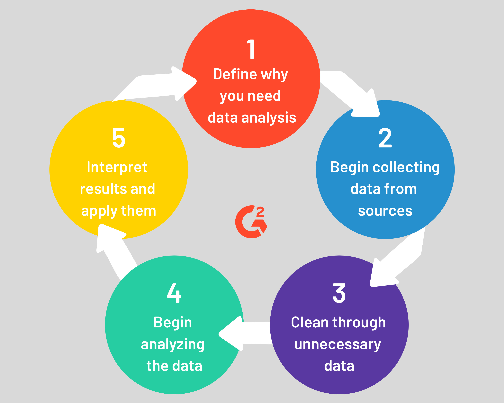
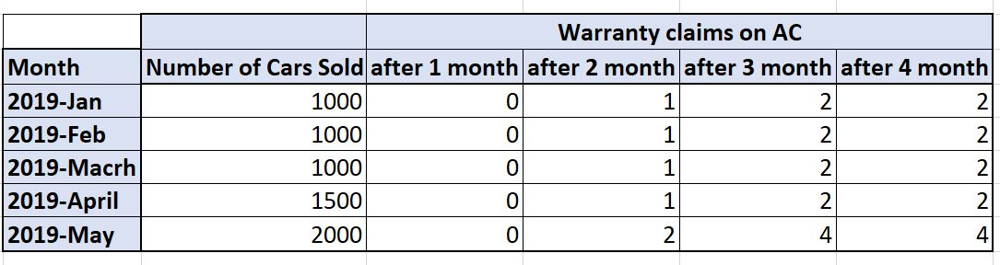
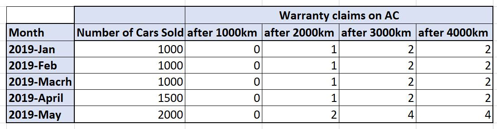

Application of Data Analytics in Automotive Industry
================
How warranty claims data can be used to improve the quality and
reliability of the cars?

# Introduction

Warranty claims and Auto Service data contain valuable information about
quality and reliability of hardware and software components of the cars.
Automotive manufacturer and their partners view such data as the most
valuable feedback about their products. Such data can aid *Engineering
Team* with design modification and quality improvements. Moreover, Auto
Service data can help *Sales and Customer Service Team* with estimating
product failures and decisions on warranty policy.

In this report, I use the success story of KIA MOTORS as an example to
discuss how any automotive manufacturers can benefit from analyzing the
warranty claims and automotive service reports.

This report is organized based on the standard procedure for data
analysis. You can read about this process from
[Wikipedia](https://en.wikipedia.org/wiki/Data_analysis), and
[G2-blog](https://www.g2.com/articles/data-analysis-process).

Fig 1. Data Analysis Process

# Define Bussiness Objectives

Understanding the business objectives of the project is key to ensuring
its success. This should always be the first phase of any data analytics
project. After all, we want to find the answer to organizational needs.

Based on the report, *KIA MOTOROS* has the following objectives:

1.  Improves products quality

2.  Provide smooth car maintenance experience

The above business objectives are actually correlated. Smooth and
on-time car maintenance can lead to improved products quality and
consequently higher level of safety. On the other hand, if KIA Motors,
manufactures parts with higher quality, major maintenance and repair
service are less often needed.

*Which metrics to track along the way?*

One of the metrics which indicates the product quality is warranty
claims. Warranty claim, in simple words, means a product failed before
the expected life cycle.

In next section, we discuss what kind of data are needed in order to
achieve this goal.

# Data Collection

After the business objectives, and project goals are defined, it’s time
to start collecting the data needed for analysis. Sometimes, we need to
define new data pipelines and procedures for collecting a very specific
data. But more often, there is some historic data records available, and
we need to perform some pre-processing to extract the required metrics.
*Data Collection* includes defining the data sources, it’s credibility,
and fields or parameters to capture.

Here, I think that *KIA MOTORS* can use the following and data source:

## 1\. Warranty sales, and Warranty Claims from Product Warranty Center:

We can contain information such as

  - Parts INFORMATION:
      - replacement or repair of the product,
      - reason for a parts failure,
      - Serial number
  - COST INFORMATION:
      - associated hardware costs,
      - associated labor costs
  - GENERAL INFORMATION:
      - Car mileage at time of warranty claims,
      - time passed since car was purchase for the first time,
      - name of owner,
      - location of car including country and city,
      - time the warranty claim was submitted,
  - VEHICLE INFORMATION:
      - Make, (some automotive brands are an umbrella to several makes )
      - Model,
      - VIN number, etc.
  - WARRANTY INFORMATION
      - warranty plan (id, duration, previous claims on this warranty,)

Warranty claims are submitted during the *Warranty periods* defined in
warranty plans. Because customers may op-to different warranty plans
(e.g 3 YEAR vs. 5 YEARS), we need to combine the information from both
warranty sales and and warranty claims.

For example: If a customer with 3 -YEAR plan does not submit a claim, it
only indicated the product quality within 3 YEAR. For such customers,
parts failure beyond the warranty plan, should be entered as NULL/NOT
AVAILABLE.

## 2\. Repair and Maintenance Reports from Certified Dealership and Auto Service

We can use certified dealership and auto service as a reliable source to
obtain valuable data.

**Information about the cars on the road which are no longer under
warranty:**

  - Parts INFORMATION:
      - replacement or repair of the product,
      - reason for a parts failure,
      - Serial number
      - *Last time this part was repaired or replaced*
  - COST INFORMATION:
      - associated hardware costs,
      - associated labor costs
  - GENERAL INFORMATION:
      - Car mileage at time of warranty claims,
      - time passed since car was purchase for the first time,
      - name of owner,
      - location of car including country and city,
      - time the warranty claim was submitted,
  - VEHICLE INFORMATION:
      - Make, (some automotive brands are an umbrella to several makes )
      - Model,
      - VIN number, etc.

**Information about customer maintenance behavior**

This information can be used to identify the correlation about customer
maintenance behaviors and parts failure. For example, future warranty
plans can be updated with new mandatory maintenance cycles.

  - MAINTENANCE BEAVIOR :
      - For each visit: Date, Service type, customer self-report,
        Technician report  
      - Car conditions in last visits
      - Technician suggested maintenance and customer follow up on
        suggestions

## 3\. Manufacturing information from production sites

This information can be used to identify the correlation about
manufacturing process and parts failure. For example, we may identify
the parts manufactured in a specific production site have a higher
failure rate. Or, we may find out chip purchased from a Company A, have
higher rate of failures than chip purchased from Company B.

  - VEHICLE INFORMATION:
      - Make,
      - Model,
      - VIN number,
  - PRODUCTION INFORMATION:
      - Date and time of assembly
      - Production site
      - Assembly team (name and info)
      - Quality Control information: date, time, QA staff
  - PARTS INFORMATION: (for each parts assembled in the car)
      - Serial Number
      - Part Manufacturer,
      - Part date of production
      - Part seller (if not purchased directly from seller)

# Data cleaning and pre-processing

Once we have the data, it’s time to get to work on it:

  - Remove Personal Information
    
      - To protect the privacy of our customers, we can remove personal
        information such as name, family name, adress, bank account, etc
        from the data.
    
    **This step is probably the very first action on collected data.This
    process is usually done automatically, or by certifed analyst before
    shaering the data with rest of the company.**

  - Explore the data to understand what kind of information we have, and
    in which format.
    
      - We may need to mix, merge and filter data from multiple source
        and tables.
      - We may need to convert some of the data to other formats.

  - Clean the data to avoid any issue when applying algorithms.
    
      - We may have got different spellings for same words,
      - we may have got different score/qualitative words from different
        dealerships.
      - We need to make decision about missing information, and how we
        want to handle it (discard, imputation, decision tree).

  - Purge duplicate data
    
      - There is a chance to recieve duplicate enteries from warranty
        ceneter or dealership. It is always a good idea to identify and
        remove the duplicates

  - Investigate the outliers
    
      - It is important to calculate the stats for each field, and
        identify the mean, median and outliers. Then we need to
        investigate outliers. We may need to even ask Subject Matter
        Experts about outliers to see if it is a mistake or, it real
        indicates an unusual phenomon.

# Data Analysis and Results Interpretation

So far, we have collected the data, and perform some basic
pre-processing and data cleaning. Now it is time for data analysis.

## Natural Language Processing and Sentiment Analysis

We probably need to use NLP and sentiment analysis, to transform some of
the text data to structured format. We then can use this structured data
in main data analysis.

For example, the we may receive the following input from a technician:

*“Customer complained about the AC causing bad odor in the car. Upon
investigation, I found out there is no issue with AC, but customer needs
to flush the engine water”*

Transformed to:

{‘Date’: ‘2021-12-02’; ‘Part’ : ‘AC’; ‘Issue’ : ‘None’;
‘CustomerComplain’ : ‘bad odor’;..}

Then we can use this pre-processed, and structured data for analysis.

**So here is the suggested format:**

Given:

  - The unstructured text data from different source discussed in *Data
    Collection*

Use:

  - Natural Language Processing Techniques

To:

  - to systematically identify, extract, quantify the related
    information
  - to systematically categorize customer maintenance experience

## Time-Based Weibull Analysis

We can plot failure rates versus time, and determine the parameters for
a 2-parameter Weibull distribution. Then, we can use the estimated
formula to predict the future failures for each part. Auto sales and
approved warranty claims are the data which we need for performing
Weibull Analysis on parts failures.

By analyzing the the number of cars (inducing all parts) which are sold
in each given time period (e.g. month), and the numbers of approved
warranty claims on cars sold in same period, Weibull Analysis can be
performed.

Fig 2. Sample data inpute for Weibull Analysis

**So here is the suggested format:**

Given:

  - Products Sales information: VIN, Date
  - Approved warranty claims: VIN, Part, Date

Use:

  - Weibull Analysis

To:

  - determine the parameters for Weibull distribution

## Mileage-Based Weibull Analysis

Time-Based Weibull Analysis probably works fine in normal situation,
because the expected yearly mileage on *specific* car make and model in
Canada is almost same. But since start of the pandemic, driving behavior
has changed. Many people are working from home, and and driving less. On
the other hand, some people drive even more than before because they
want to get away from city and spend time in nature.

As a results, time-based weibull analysis might not be effective
anymore. I think we can use Mileage-Based Weibull Analysis. We can plot
failure rates versus mileage, and determine the parameters for a
2-parameter Weibull distribution. Mileage and approved warranty claims
are the data which we need for performing Mileage-Based Weibull Analysis
on parts failures.

*For Time-Based Weibull Analysis we can use data from many several years
ago, thus we can estimate the distribution better. For Mileage-Based
analysis, we probably have less data- but the model probably works
better for cars with mileage/year deviating from the norm in previous
years *

Fig 3. Sample data inpute for Weibull Analysis

**So here is the suggested format:**

Given:

  - Products Sales information: VIN, Date
  - Approved warranty claims: VIN, Part, Date, Mileage

Use:

  - Weibull Analysis

To:

  - determine the parameters for Mileage-Based Weibull Analysis

## Forecast Failure Rates and Maintenance Costs

Now we can use the estimated Weibull distribution to estimate the
failures through the warranty period.

**So here is the suggested format:**

Given:

  - Weibull distribution from last parts

Use:

  - Weibull Analysis

To:

  - Predict the number of warranty claims you can expect for each part
    in future time periods.

If we use this rate along with the repair or replacement costs, we can
estimate the Maintenance Costs through the warranty period. For example
we may predict that there will be 12 warranty claims on AC in Toronto in
January 2022.

Predicted Number X The expected costs per unit =  
The estimated maintenance costs for AC warranty in Toronto.

Given:

  - Predicted warranty claims from previous analysis
  - list of parts and total associated cost of repair and replacements
  - list of parts and total labor-hours required for service

Use:

  - Math

To:

  - to calculate the *EXPECTED units* which should be shipped to each
    region
  - to calculate the *EXPECTED number of technician* needed in each
    region
  - to calculate the *EXPECTED Maintenance Costs* for company to
    full-fill the warranties

## Optimization of warranty reserve policies

Warranty Reserve is a fund maintained by the manufacturer finance team
to fulfill the warranty expenses. Automotive manufacturers are liable
for total warranty costs for the whole life of their products. But
parking all that money in a reserve fun would cause opportunity cost.
That’s why warranty reserves are set to a much smaller values.

To understand how warranty reserve works, you think about your personal
emergency fund. You need to save some money for un-expected and
emergency costs. + If you do not have enough emergency fund, then you
need to borrow from your credit card with interest rate of 19%. + If you
save all your money, then you loose the opportunity to invest in stock
market and cryptocurrencies (let’s assume 15% profit)

warranty reserves works just like your personal emergency fund.

Given:

  - Predicted warranty claims through the warranty period of each
    vehicle
  - Predicted Maintenance Costs through the warranty period of each
    vehicle
  - opportunity cost associated to parking excess money in reserve
  - Liability cost associated to not having enough money in reserve

Use:

  - Optimization techniques

To:

  - Calculate the minimum amount of money needed for warranty reserve

## Identify the anamolies in production sites

Here, we investigate to see if there is correlation between any
manufacturing process and parts failure. For example, we may identify
the parts manufactured since October 2021 have higher rate of failures.
Can then investigate the production line to find the root cause.

  - Production time and parts failure

  - Production site and parts failure

  - Parts provider and parts failure

Given:

  - Approved warranty claims: VIN, Part, Serial Number

Use:

  - CUSUM

To:

  - detect sudden increase in number of warranty climas on a specific
    parts

Then, we can use this information,

  - alarm the engineering team to investigate the production line and
    find the root cause

  - plan for extra spare parts to be shipped to dealerships for warrant
    service

  - Inform finance team to collaborate with engineering team, and plan
    for a possible *recall*

## Improve the Products Quality

Here, we investigate to see if we can improve the quality of products.
The main goal is to provide some feedback to our Technical Design and
Engineering Team. Many data analytics method can be used here, but I
only focus on *Clustering*.

**Here is an example:**

Please note that the following is just an example to illustrate the
process.

1.  we run a clustering algorithm on AC failures based on the *customer
    location*. We notice that the failures rate of AC in Canada is
    2-times the US.

2.  Based on this results, we then run a clustering algorithm on AC
    failures based on *Weather Condition* where the car is purchased. We
    find that AC failures in USUALLY-COLD regions is 10 times the AC
    failures in USUALLY-WARM regions.

3.  Based on this results, our engineering team starts to research about
    the impact of cold weather on integrated circuits, and provides an
    alternative design for COLD WEATHER conditions.

Given:

  - Approved warranty claims: VIN, Part, Serial Number
  - Predicted failure rates from previous sections
  - Sales information: VIN, CITY
  - Manufacturing data: VIN, Production Site, QA Staff

Use:

  - Clustering algorithms

To:

  - detect systematic pattern in historical parts failure or even
    predicted parts failure (systematic pattern: specific production
    site, specific QA team, Specific Parts Seller, Specific weather
    conditions, etc)

We may also use regression to find the most important factors on
failures, and take action.

# Summary

In this article we investigated how any automotive manufacturer can
improve the product quality, and smooth the maintenance experience for
customers. We discussed what data should be collected, and from which
sources. We the investigate what kind of data analytics method should be
applied on data before we present the results to our stakeholders
(Engineering Team, Finance TEAM, Customer Service, Dealerships).

Regarding the frequency of data collection, and model execution, *based
on my observation*, there is usually two stages in data analytics. Stage
one is the experimental step. This is where data analytic team works on
this problem for the first time. If the management and business owners
find the output satisfactory, the data project is moved to stage 2 or
automation. Stage two is where live or semi-live data pipeline and
platforms are implemented using SAAS and other analytic platform.

In this project, we need to have the warranty, sales and manufacturing
data at least on a monthly basis. then, we can update our weibull
analysis on monthly periods and re-build everything else on top of that.
