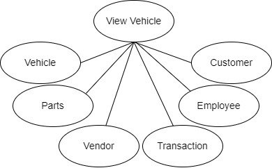
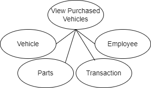
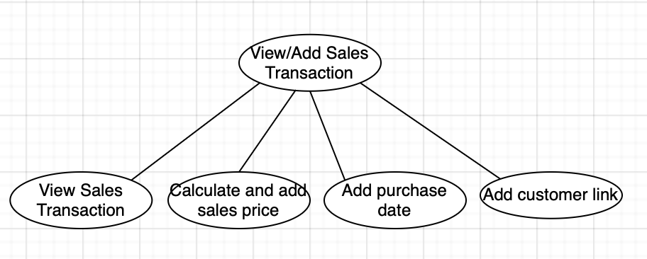
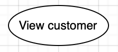
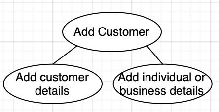
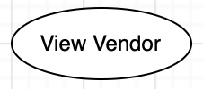
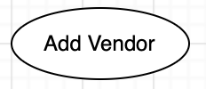

```{r setup, include=FALSE}
knitr::opts_chunk$set(echo = TRUE)
```

# Table of Contents
+ [Data Types](#data-types)
  1. [Vehicle](#vehicle)
  2. [Transaction](#transaction)
  3. [Employee](#employee)
  4. [Order](#order)
  5. [Part](#part)
  6. [Vendor](#vendor)
  7. [Customer](#customer)
  8. [Individual](#individual)
  9. [Business](#business)
+ [Business Logic Constraints](#business-logic-constraints)
+ [Task Decomposition and Abstract Code](#task-decomposition-and-abstract-code)
  1. [Log In](#login)
  2. [Inventory Search](#inventory-search)
  3. [View Purchased Vehicles](#view-purchased-vehicles)
  4. [View Monthly Sales Report](#view-monthly-sales-report)
  5. [View Parts Statistics Report](#view-parts-statistics-report)
  6. [View Price Per Condition Report](#view-price-per-condition-report)
  7. [View Average time in Inventory Report](#view-average-time-in-inventory-report)
  8. [View Seller History Report](#view-seller-history-report)
  9. [View Add Sales Transactions](#viewadd-sales-transaction)
  10. [View/Add Customer](#viewadd-customer)
  11. [Add vehicle](#add-vehicle)
  12. [View/order parts](#add-parts-order)
  13. [View/add vendors](missing)
  14. [View Vehicle Detail](#view-vehicle)


\pagebreak
# Data Types

## VEHICLE

| Attribute      | Data type | Nullable  |
|----------------|-----------|-----------|
| VIN            | String    | Not Null  |
| Manufacturer   | String    | Not Null  |
| Type           | String    | Not Null  |
| Model_name     | String    | Not Null  |
| Model_year     | Integer   | Not Null  |
| Color          | List\<String\> | Not Null  |
| Fuel_type      | String    | Not Null  |
| Mileage        | Float     | Not Null  |
| Description    | String    | Null      |
| Condition      | String    | Not Null  |


## TRANSACTION 
***(Transaction represents BUY and SELL relationship type in EER diagram)***

| Attribute      | Data type | Nullable |
|----------------|-----------|----------|
| Purchase_date   | Date      | Not Null |
| Purchase_price  | Float     | Not Null |
| Sale_date       | Date      | Null  	|


## EMPLOYEE

| Attribute  | Data type | Nullable  |
|------------|-----------|-----------|
| Username   | String    | Not Null  |
| Password   | String    | Not Null  |
| First_name | String    | Not Null  |
| Last_name  | String    | Not Null  |
| Rolename   | String    | Not Null  |

## PARTS_ORDER

| Attribute    | Data type | Nullable  |
|--------------|-----------|-----------|
| Ordinal      | String    | Not Null  |
| Quantity     | Integer | Not Null  |


## PART

| Attribute    | Data type | Nullable  |
|--------------|-----------|-----------|
| Part_number  | String    | Not Null  |
| Status       | String    | Not Null  |
| Cost         | Float     | Not Null  |
| Description  | String    | Null      |


## VENDOR

| Attribute   | Data type | Nullable |
|-------------|-----------|----------|
| Vendor_name  | String    | Not Null  |
| Phone_number | String    | Not Null  |
| Street      | String    | Not Null  |
| City        | String    | Not Null  |
| State       | String    | Not Null  |
| Postal_code  | String    | Not Null  |


## CUSTOMER

| Attribute   | Data type | Nullable  |
|-------------|-----------|-----------|
| Street      | String    | Not Null  |
| City        | String    | Not Null  |
| State       | String    | Not Null  |
| Postal_code | String    | Not Null  |
| Email       | String    | Null      |
| Phone_number| String    | Not Null  |


## INDIVIDUAL

| Attribute               | Data type | Nullable  |
|-------------------------|-----------|-----------|
| Driver_license_number   | String    | Not Null  |
| First_name              | String    | Not Null  |
| Last_name               | String    | Not Null  |

## BUSINESS

| Attribute | Data type | Nullable |
|-----------|-----------|----------|
| Tax_id_number  | String | Not Null |
| Business_name | String | Not Null |
| First_name | String    | Not Null |
| Last_name  | String    | Not Null |
| Title     | String    | Not Null |

\pagebreak
# Business Logic Constraints

## General Constraint
Database Administrator will have the access to add/update/delete all pre-defined datasets for the entites mentioned below:
+ VehicleTypes
+ Manufacturers
+ FuelTypes
+ Colors

## Vehicle
+ Model year cannot exceed the current year plus one
+ Model year should include century digits
+ Vehicle cannot be returned for any public search results or be sold if it has any parts pending or not installed
+ If no vehicles meet the search criteria of Vehicle Search form, then a message should be displayed: "Sorry, it looks like we don’t have that in stock!"
+ Vehicle search results should be sorted by VIN in ascending order
+ The fuel type of the vehicle is also tracked, which can be one of the following: Gas, Diesel, Natural Gas, Hybrid, Plugin Hybrid, Battery, or Fuel Cell.
+ Sales Price is calculated as 125% of the original price combined with 110% of any parts costs associated with the vehicle
+ Car will be sold only once to BuzzCars

## Parts
+ PurchaseOrderNumber is auto-generated by combining the VIN with the ordinal of the order
+ Clerk cannot revert a part status to its previous status (such as installed to ordered)
+ Parts order status must be from the following values (ordered/received/installed) 

## Employee
+ All employees will have the privilege to search vehicle by VIN
+ For Inventory clerk and Manager rolenames, the vehicle search screen must show the number of vehicles currently with parts pending along with the number of vehicles available for purchase
+ Inventory clerk Vehicle search result should include any vehicle that has not been sold even those with parts pending
+ Inventory clerk Vehicle detail page should show original purchase price and the total of all parts costs
+ Manager will have the option to filter by sold vehicles, unsold vehicles, or all vehicles
+ Manager Vehicle detail page should show all information for the car – including all of the seller’s contact information (everything except their driver’s license or tax ID number), the name (first and last) of the inventory clerk that purchased the car, the original purchase price, the purchase date, the total cost of parts, and a parts section listing details for all parts. In addition, if the car has been sold, the buyer’s contact information (everything except their driver’s license or tax ID number), sales date, and the salesperson’s name (first and last) will be displayed


\pagebreak
# Task Decomposition and Abstract Code 
TD/AC for each Task including oval diagrams for each task on remaining pages of report


## <ins>Login</ins>
### Task Decomp


+ Lock Types: Read-only on Employee table
+ Number of Locks: Single
+ Enabling Conditions: None
+ Frequency: Around 200 logins per day
+ Consistency (ACID): not critical, order is not critical.
+ Subtasks: Mother Task is not needed. No decomposition needed.

### Abstract Code
+ Employee enters *username* ($Username), *password* ('$Password') input fields.
+ When ***Enter*** button is clicked:
  + If Employee username is not found:
     + Go back to <ins>**Login**</ins> form, and raise an error message "Please Contact DB Administrator".
  + If Employee record is found but Employee.password != '$Password':
    + Go back to <ins>**Login**</ins> form, and raise an error message "You entered the wrong password".
  + If Employee username and password matches with the expected values:
    + Store role information as session variable '$Role'.
    + Luanch the <ins>**Vehicle Search page**</ins> with additional features.

## <ins>View Vehicle</ins>
### Task Decomp



+ Lock Types: Read-only on Vehicle table, Employee, Transaction, Parts
+ Number of Locks: Several different schema constructs are needed.
+ Enabling Conditions: Some tasks are enabled by Vehicle lookup. Some task are enabled by a user’s login, and Vehicle lookup.
+ Frequency: Around 20000 logins per day
+ Consistency (ACID): not critical, order is not critical.
+ Subtasks: All tasks must be done, but can be done in parallel. Mother task is required to coordinate subtasks. Order is not necessary.


### Abstract Code
+ Users click on an ***individual result*** from <ins>**Vehicle Search page**</ins>
+ Run the **View Vehicle** task: query for information about the vehicle where $VIN is the VIN of the selected Vehicle from Vehicle Search Results; 
  + Find current *Vehicle* using vehilce's $VIN; Display VIN, vehicle type, Model Year, Model Name, Manufacturer, fuel type, color(s), mileage, sales price, and the description of the car
  + Find Transaction using the vehilce's $VIN. Find purchase price from Transaction
    For each Order for the vehilce's $VIN, group and find the total of all parts costs.
    Calculate sale price as 125% of the original purchase price added to 110% of any parts costs also associated with the vehicle.
    Display sale price.
  + Identify if user is logged in; Identify if the employee role using $Rolename from Employee:

    + **if $Employee.role = "Inventory Clerk" or "Owner"**
      + Find the corresponding *Transaction* using the Vehicle VIN; Display $Purchase-price from *Transaction*
      + Find each *Order* for the current Vehicle:
        + Display $Vendor_name and purchase order from *Order*.
        + From *Vendor*, find and display vendor's $Phone_number and address ($Street, $City, $State, $Postal_code)
        + From *Part*, find and display part number, description, cost, and status; Group and Display total of all parts costs
		
		
    + **if $Employee.role = "Manager" or "Owner"**
 
      **Sell Infortmation (car sold to BuzzCar)**
      + Find the corresponding initial *Transaction* using the Vehicle VIN; Display $Purchase-price.
        + Find and Display Employee/Inventory Clerk's name (first and last) for the current transaction.
        + Find and Display Customer's $Street, $City, $State, $Postal_code, $Phone number, $Email for the current transaction.
          + If Individual, display first and last names.
          + If Business, display business name, primary contact's name and title.
      		
      + Find each *Order* for the current Vehicle:
        + Display $Vendor_name and purchase order from *Order*.
        + From *Vendor*, find and display vendor's $Phone_number and address ($Street, $City, $State, $Postal_code)
        + From *Part*, find and display part number, description, cost, and status; Group and Display total of all parts costs
      
      
      **Buy Infortmation (car sold by BuzzC)**
      + Find the corresponding *Transaction* using the Vehicle VIN; Display $Sale_date
        + Find and Display Employee/Inventory Clerk's name (first and last) for the current transaction.
        + Find and Display Customer's $Street, $City, $State, $Postal_code, $Phone number, $Email for the current transaction.
          + If Individual, display first and last names.
          + If Business, display business name, primary contact's name and title.


## <ins>View Purchased Vehicles</ins>

### Task Decomp



+ Lock Types: Read-only on Vehicle table, Employee, Transaction, Parts
+ Number of Locks: Several different schema constructs are needed.
+ Enabling Conditions: All tasks are enabled by user’s login, and user role being Inventory clerks.  **What about owner?**
+ Frequency: Around 200 view per day
+ Consistency (ACID): not critical, order is not critical.
+ Subtasks: All tasks must be done, but can be done in order. Mother task is required to coordinate subtasks. Order is not necessary

### Abstract Code
+ User clicked on ***View Purchased Vehicles*** button from <ins>**Vehicle Search**</ins>: 
+ User must be loged in. Identify employee $Username
+ Identify employee $Role. User's role must be Inventory clerk.
+ Run the **View Purchased Vehicles** task: Query for information about the vehicles where $Buyer is the $Username of the current employee, and $SaleDate from *Transactions* is Null.
	+ Group the query results based on $Status from *Parts*:
	+ Display the count of vehicles with $Status is either Null or "installed"- as the number of vehicles currently with parts pending 
	+ Display the count of vehicles with $Status is not "installed"- as the number of vehicles available for purchase.


##  <ins>Add Vehicle</ins>
### Task Decomp
+ Lock Types: Write lock
+ Number of Locks: 1
+ Enabling Conditions: All tasks are enabled by user’s login, and user role being Inventory Clerk or Owner.
+ Frequency: 50
+ Consistency (ACID): Critical. Multiple tasks can be accessing the Vehicle data at the same time.
+ Subtasks:  Mother Task is not needed. No decomposition is necessary. (CONFIRM *???*)

### Abstract Code 
* if User.type=Employee.Inventory_Clerk or User.type=Employee.Owner (referred as User in this section)
	* Display the  **Add Vehicle** button on their dashboard
		- if User clicks on the Add Vehicle, navigate to Add Vehicle form
		- The User will fill out the form with following fields:
		-	**Add Vehicle form**
			*Form Input Fields*:
			-   _VIN (Vehicle Identification Number)_ (String): Must be unique and adhere to standard VIN formatting. Cannot be left blank.
			    


			-  _Vehicle type_ (Dropdown list): Field cannot be empty. Predefined choices (e.g., Sedan, SUV, Truck, etc.).

			-  _Model Year_ (Integer): Must be a valid year (e.g., 1980 to current year). Cannot be left blank.

			-  _Manufacturer_ (Dropdown list): Field cannot be empty. Predefined choices (e.g., Ford, Honda, Toyota, etc.).

			-  _Model Name_ (String): Cannot be left blank and should be less than a predefined character limit.

			-  _Fuel type_ (Dropdown list): Field cannot be empty. Predefined choices (e.g., Gasoline, Diesel, Electric, etc.).

			-  _Color(s)_ (Multiple selection or comma-separated input): At least one color should be selected or input. If comma-separated, each color should be valid (e.g., no numeric values).

			-  _Mileage_ (Float): Must be a non-negative number. Precision up to two decimal places.

			-  _Sales Price_ (Float): Must be a positive number and can have precision up to two decimal places.

			-  _Description_ (Text area): Can be left blank but if entered, should be within a predefined character limit.

			  

			- Button: _Submit_
			
	    
	 - if User clicks on the **Submit button**.
	    
	    -   Validate the input fields for data integrity. 
	        
	    -   If all details are valid:
	        
	        -   Save the vehicle information to the database.
	        -   Navigate the clerk to the detail page for the newly added vehicle.
	    -   Else:
	        -   Display appropriate error messages related to invalid or missing input.


##  <ins>View/Add Parts Order</ins>
This task is divided into two parts (View Parts Order and Add Parts Orders).

## Add Parts Order
### Task Decomp
+ Lock Types: Write
+ Number of Locks: 1
+ Enabling Conditions: All tasks are enabled by user’s login, and user role being Inventory Clerk or Owner.
+ Frequency: 300
+ Consistency (ACID): Critical. Multiple tasks can be accessing the Parts Order data at the same time.
+ Subtasks: Mother Task is not needed. No decomposition is necessary. (CONFIRM *???*)
### Abstract Code
- If User.type = Employee.Inventory_Clerk or User.type = Employee.Owner (referred to as User in this section):
	-   Display the **Add Parts Order** button on their dashboard.
	-   If User clicks on the **Add Parts Order** button, navigate to the **Add Parts Order form**.
	-   The User will fill out the form with the following fields:

		- **Add Parts Order form** _Form Input Fields_: 
			- _Vehicle VIN (Vehicle Identification Number)_ (String): Must match a VIN in the system. Cannot be left blank.
			- _Vendor_ (Search  & Dropdown/Selection): 
				- If existing, search  and select. 
				- If new: follow the Abstract Code for Add New Vendor 
			- _Purchase Order Number_ (Auto-Generated String): Displays auto-generated order number based on VIN and ordinal (read-only). 
			- _Parts List_ (Repeating group/section for  each part): 
				-  _Part Number_ (String): Can be alphanumeric. Cannot be left blank. 
				- _Description_ (String): Brief about the part. Cannot be left blank. 
				-  _Cost_ (Float): Must be a positive number with  precision up to two decimal places. 
				-  _Quantity_ (Integer): Must be a positive integer. 
				-  _Status_ (Dropdown list): Predefined choices (Ordered, Received, Installed). Cannot be left blank. 
			-  Button: _Submit_
	-   If User clicks on the **Submit button**:
	    -   Validate the input fields for data integrity.
	    -   If all details are valid:
	        -   Save the parts order information to the database.
	        -   Navigate the clerk to the vehicle detail page to view the recently added parts order.
	    -   Else:
	        -   Display appropriate error messages related to invalid or missing input.


## View Parts Order
### Task Decomp
+ Lock Types: Read (Parts Order, Parts)
+ Number of Locks: 2
+ Enabling Conditions: All tasks are enabled by user’s login, and user role being Inventory Clerk, Manager or Owner.
+ Frequency: 200
+ Consistency (ACID): Not critical. View Parts Order is not critical.
+ Subtasks: Mother Task is not needed. No decomposition is necessary. 
### Abstract Code
+ User is in the <ins><b>View Vehicle</b></ins> and <em><b>Parts Order</b></em> is rendered.
+ When user clicks on a Vehicle, run the **View Parts Order** task: query parts order by parts_order and display all fields related to View Parts.
+ Present the result of the query to the user

##  <ins>Inventory Search</ins>
### Task Decomp


+ Lock Types: Read-only on: Vehicle table, Transaction table, PARTS_ORDER table, Vendor table, and Part table. 
+ Number of Locks: Five locks
+ Enabling Conditions: Search button with valid query
+ Frequency: Around 20000 or more searches per day
+ Consistency (ACID): Not critical; ordering of tasks does not affect the database. 
+ Subtasks: Mother Task is not needed. No decomposition is necessary.

### Abstract Code
+ When user accesses **<u>Inventory Search</u>**
  + Present <u>**Inventory Search Form**</u> Containing:
      + Number of Vehicles Available for Purchase <- count(rows(Vehicle table where vehicle does not have row in Sell table and (vehicle does not have a PARTS_ORDER or where a row in Vehicle links to PARTS_ORDER and PARTS_ORDER links to Vendor and Vendor links to Parts, status=installed for all parts the PARTS_ORDER)))
    + (Drop down boxes):
      + ***Vehicle type*** <- distinct Vehicle.type
      + ***Manufacturer*** <- distinct Vehicle.manufacturer
      + ***Model Year*** <- distinct Vehicle.Model_year
      + ***Fuel Type***  <- distinct Vehicle.Fuel_type
      + ***Color***  <- distinct Vehicle.Color
    + *Keyword Search* (Window)
    + if user is not logged in:
      + ***Login*** (button)
    + if user is logged in:
        + *VIN Search* (Window) 
      + if User.type=Employee.Inventory_clerk or User.type=Employee.Manager or User.type=Employee.Owner:
        + Number of Vehicles available with Parts Pending <- count(rows(Vehicle table where vehicle does not have row in Sell table and (where a row in Vehicle links to PARTS_ORDER and PARTS_ORDER links to Vendor and Vendor links to Parts, status=ordered or status=received for at least one part in PARTS_ORDER)))
      + if User.type=Employee.Inventory_clerk or User.type=Employee.Owner:
        + ***View Purchased Vehicles*** (button) <- Vehicle table where vehicle has a row in Sell table and row in Sell table has Sale_date that is not NULL. 
      + if User.type=Employee.Manager or User.type=Employee.Owner:
        + ***Reports*** (Drop Down Box):
          * ***Seller History***
          * ***Average Time in Inventory***
          * ***Price Per Condition***
          * ***Parts Statistics***
          * ***Monthly Sales***
        + ***Filter Query*** (Drop Down Box):
          + ***Sold Vehicles***
          + ***Unsold Vehicles***
          + ***All Vehicles***
    * <u>User Input</u>
      * If input is ***Login*** (button) click: Present **<u>Login form</u>**
      * If input is ***View Purchased Vehicles*** (button) click: 
        * for list of (Vehicle that does not connect to row in *Transaction table*), return:
          * VIN <- Vehicle.Vin 
          * Type <- Vehicle.type
          * Model <- Vehicle.Model_year
          * Manufacturer <- Vehicle.Manufacturer
          * Vehicle <- Vehicle.Model_name
          * Fuel Type <- Vehicle_Fuel_type
          * Color <- Vehicle_Color[]
          * Mileage <- Vehicle.Mileage
          * Price <- Vehicle=Buy.Purchase_price * 1.25 + sum(Vehicle=PARTS_ORDER.Quantity * PARTS_ORDER=Vendor=Part.Cost) * 1.10
      * If input is in ***Reports***:
          * input(***Seller History***), present: *Seller History Report*
          * input (***Average Time in Inventory***), present: *Average Time in Inventory Report*
          * input (***Price Per Condition***), present: *Price per Condition Report*
          * input (***Parts Statistics***), present: *Parts Statistics Report*
          * input (***Monthly Sales***), present: *Monthly Sales Report*
      * If input is ***Search*** (button) click:
        * If filter is selected: (apply selected filter(s))
          * ***Vehicle type*** -> apply: where Vehicle.Type={UserInput}
          + ***Manufacturer*** -> apply: where Vehicle.manufacturer={UserInput}
          + ***Model Year*** -> apply: Vehicle.Model_year={UserInput}
          + ***Fuel Type***  -> apply: Vehicle.Fuel_type={UserInput}
          + ***Color*** -> apply Vehicle.color={UserInput}
        * if *VIN Search* input is not empty:
          + apply Vehicle.Vin={UserInput}
        * if *Keyword Search* input is not empty:
          * apply for each row in query: row contains {UserInput}
        * if ***Filter Query*** contains:
          * ***Sold Vehicles*** -> apply: Vehicle in Sell table
          * ***Unsold Vehicles*** -> apply: Vehicle not in Sell table; apply: Parts.status=Installed or Parts.status=Ordered or Parts.status=Received
          * ***All vehicles*** -> apply: Parts.status=Installed or Parts.status=Ordered or Parts.status=Received 
        * Add (any) filter updates to core search query for public users:
          * apply search query: *Vehicle table* where vehicle does not have a row in *Transaction table* and (vehicle does not have a PARTS_ORDER or where a row in Vehicle links to PARTS_ORDER and PARTS_ORDER links to Vendor and Vendor links to Parts, status=installed for all parts the PARTS_ORDER))


   
    

##  <ins>View/Add Sales Transaction</ins>
### Task Decomposition



+ **Lock Types:** read lock (EMPLOYEE, VEHICLE, TRANSACTS, PARTS_ORDER, CUSTOMER, INDIVIDUAL or BUSINESS) and write lock (TRANSACTS)
+ **Number of Locks:** 6 read locks, 1 write lock
+ **Enabling Conditions:** All locks are enabled by owners and salespeople, plus a separate view/add request. Only read locks are enabled by managers, plus a separate view request.
+ **Frequency:** Around 50 adds and 100 views per day
+ **Consistency (ACID):** Not critical, order is not critical
+ **Subtasks:** All tasks must be done, but can be done in parallel. Mother task is required to coordinate subtasks. Order is not necessary.

### Abstract Code
+ coming soon


##  <ins>View/Add Customer</ins>
This task is divided into two parts (View Customer and Add Customer).

##  <ins>View Customer</ins>
### Task Decomposition



+ **Lock Types:** read lock (CUSTOMER, INDIVIDUAL, BUSINESS) 
+ **Number of Locks:** 3 read locks
+ **Enabling Conditions:** When any employee (inventory clerk, salesperson, manager, owner) is performing a purchase or sales transaction, all read locks are enabled.
+ **Frequency:** Around 100 views per day
+ **Consistency (ACID):** Not critical, order is not critical
+ **Subtasks:** Mother Task is not needed. No decomposition needed.

### Abstract Code
+ User is in the <ins><b>Add Vehicle Form</b></ins> or <ins><b>Sales Order Form</b></ins> and the <em><b>Customer Lookup</b></em> button is rendered.
+ While no buttons are clicked, do nothing.
+ If <em><b>Customer Lookup</b></em> is clicked, render radio buttons for user to select their identifier type, <em><b>Drivers License Number</b></em> or <em><b>Tax Id Number</b></em>; only one can be selected. Also render an <em><b>Indentifier</b></em> input field for the user to enter the this data and a <em><b>View Customer</b></em> button.
+ If <em><b>View Customer</b></em> is clicked without a radio button selection or an entered <em><b>Indentifier</b></em>, display an error for missing input.
+ If <em><b>Drivers License Number</b></em> is selected and <em><b>Indentifier</b></em> is inputted and <em><b>View Customer</b></em> is clicked:
    + Query the database by Driver_license_number for First_name and Last_name from the Individual table and Street, City, State, Postal_code, Email, Phone_number from the Customer table. 
        + If the customer is found display them to the user.
        + Else render the <em><b>Add Customer</b></em> button which is an entry to the **Add Customer** task.
+ If <em><b>Tax Id Number</b></em> is selected and <em><b>Indentifier</b></em> is inputted and <em><b>View Customer</b></em> is clicked:
    + Query the database by Tax_id_number for Business_name, First_name, Last_name, Title from the Business table and Street, City, State, Postal_code, Email, Phone_number from the Customer table. 
        + If the customer is found display them to the user.
        + Else render the <em><b>Add Customer</b></em> button which is an entry to the **Add Customer** task.


##  <ins>Add Customer </ins>
### Task Decomposition



+ **Lock Types:** write lock (CUSTOMER, INDIVIDUAL, BUSINESS)
+ **Number of Locks:** 3 write locks
+ **Enabling Conditions:** When any employee (inventory clerk, salesperson, manager, owner) is performing a purchase or sales transaction and viewing a customer fails (no result found), all write locks are enabled to add a customer.
+ **Frequency:** Around 80 adds per day
+ **Consistency (ACID):** Not critical, order is not critical
+ **Subtasks:** All tasks must be done, but can be done in parallel. Mother task is required to coordinate subtasks. Order is not necessary.

### Abstract Code
+ User is in the <ins><b>Customer Form</b></ins> and the <em><b>Add Customer</b></em> button is rendered.
+ While no buttons are clicked, do nothing.
+ If <em><b>Add Customer</b></em> is clicked, render radio buttons for user to select their identifier type, <em><b>Drivers License Number</b></em> or <em><b>Tax Id Number</b></em>; only one can be selected.
+ If <em><b>Drivers License Number</b></em> is selected:
    + Render empty input fields for <em>Driver_license_number, First_name, Last_name, Street, City, State, Postal_code, Email, Phone_number</em> as well as a <em><b>Submit</b></em> button. All fields are mandatory, except for <em>Email</em>.
    + If all input fields are correctly entered and submit is clicked:
        + If duplicate Driver_license_number, display "can't add duplicate customer" error
        + If successful, update the Individual table with Driver_license_number, First_name, Last_name and Customer table with Street, City, State, Postal_code, Email, Phone_number. 
+ If <em><b>Tax Id Number</b></em> is selected:
    + Render empty input fields for <em>Tax_id_number, Business_name, Title, First_name, Last_name, Street, City, State, Postal_code, Email, Phone_number</em> as well as a <em><b>Submit</b></em> button. All fields are mandatory, except for <em>Email</em>.
    + If all input fields are correctly entered and submit is clicked:
        + + If duplicate Tax_id_number, display "can't add duplicate customer" error
        + If successful, update the Business table with Tax_id_number, Business_name, Title, First_name, Last_name and Customer table with Street, City, State, Postal_code, Email, Phone_number. 


##  <ins>View/Add Vendor</ins>
This task is divided into two parts (View Vendor and Add Vendor).

##  <ins>View Vendor</ins>
### Task Decomposition
  

**Lock Types:** read lock (VENDOR)

**Number of Locks:** 1 read lock

**Enabling Conditions:** All read locks are enabled by owners and inventory clerks, plus a separate view request.  

**Frequency:** Around 300 views per day.

**Consistency (ACID):** Not critical, order is not critical. 

**Subtasks:** Mother Task is not needed. No decomposition needed.


### Abstract Code
+ User is in the <ins><b>Parts Order Form</b></ins> and <em><b>Vendor Input Field</b></em> is rendered.
+ When a vendor's name is typed in, run the **View Vendor** task: query vendor by Vendor_name and display Phone_number, Vendor_name, Postal_code, Street, City, State to the user.
+ If the vendor is not found, display the <em><b>Add Vendor</b></em> button.


##  <ins>Add Vendor</ins>
### Task Decomposition

  

**Lock Types:** write lock (VENDOR)  

**Number of Locks:** 1 write lock  

**Enabling Conditions:** All write locks are enabled by owners and inventory clerks, plus a separate add request.  

**Frequency:** Around 20 add per day  

**Consistency (ACID):** Not critical, order is not critical. 

**Subtasks:** Mother Task is not needed. No decomposition needed.


### Abstract Code
+ User is in the <ins><b>Parts Order Form</b></ins> and **View Vendor** task did not find a vendor and <em><b>Add Vendor</b></em> button is displayed.
+ If <em><b>Add Vendor</b></em> is clicked, display the <ins><b>Vendor Form</b></ins> with empty input fields for <em>Vendor_name, Phone_number, Postal_code, Street, City, State</em> and <em><b>Save Vendor</b></em> button.
    + If ALL fields are properly entered and <em><b>Save Vendor</b></em> is clicked, Update the Vendor table with the new vendor.
        + If duplicate vendor, display "can't add duplicate vendor" error
        + If successful, update the Vendor table with the new vendor. The user can now continue filling out the <ins><b>Parts Order Form</b></ins>.


## <ins>View Monthly Sales Report</ins>

### Task Decomp
+ Lock Types: Read-only on Transaction, Employee tables
+ Number of Locks: 2 read locks
+ Enabling Conditions: A button, link and drop down menu displayed on initial search page for owner and manager. 
+ Frequency: Around 10 views per day
+ Consistency (ACID): not critical, order is not critical.
+ Subtasks: Mother Task is not needed. No decomposition needed.

### Abstract Code
+ Employee must be loged in. Identify employee $Username
+ Identify employee $Rolename. 
+ If ($Rolename == 'OWNER' or $Rolename == 'MANAGER') then
+ 	Display link or button or drop down menu to access report on initial search page
+ 	Click on either link or button or choose the report name from a drop down menu displayed on initial search page
+ 	Display the summary report on a seperate page.
+ 	Execute a DB query to calculate below values group by year and month
	+ sales transaction count
	+ total number of vehicles sold
	+ total sales income
	+ total net income (sales price - (purchase price+parts costs))
	+ For each (year and month) from DB results
		+ Print the year and month
		+ Print the output of below field values 
			+ sales transactions count, the total number of vehicles sold, the total sales income, and the total net income
		+ Click on each year and month to render a drilldown report
			+ Print the top performing salespeople (show the salesperson’s first and last name), the number of vehicles they sold  and their total sales
			+ Sort the drilldown report by total vehicles in descending order followed by total sales in descending order.
			+ If two or more salesperson tie for the top position then 
			+ Consider the highest dollar value to determine the top salesperson
		+ Print "breakline" to go to next row.


## <ins>View Parts Statistics Report</ins>

### Task Decomp
+ Lock Types: Read-only on Vendor, Parts, PartsOrder tables
+ Number of Locks: 3 read locks
+ Enabling Conditions: A button, link and drop down menu displayed on initial search page for owner and manager. 
+ Frequency: Around 10 views per day
+ Consistency (ACID): not critical, order is not critical.
+ Subtasks: Mother Task is not needed. No decomposition needed.

### Abstract Code
+ Employee must be logged in. Identify employee $Username
+ Identify employee $Rolename. 
+ If ($Rolename == 'OWNER' or $Rolename == 'MANAGER') then
	+ Display link or button or drop down menu to access report on initial search page
	+ Click on either link or button or choose the report name from a drop down menu displayed on initial search page
	+ Display the report on a seperate page.
	+ Execute a DB query to calculate below values for a given vendor
		+ Number of parts supplied by this Vendor
		+ Total dollar amount spent on parts
	+ For each (vendor) from DB results
		+ Print vendor
		+ Print the output of below field values 
			+ Number of parts supplied by this Vendor
			+ Total dollar amount spent on parts
		+ Print "breakline" to go to next row.


## <ins>View Price Per Condition Report</ins>

### Task Decomp
+ Lock Types: Read-only on Vehicle table
+ Number of Locks: 1 read lock
+ Enabling Conditions: A button, link and drop down menu displayed on initial search page for owner and manager. 
+ Frequency: Around 10 views per day
+ Consistency (ACID): not critical, order is not critical.
+ Subtasks: Mother Task is not needed. No decomposition needed.

### Abstract Code
+ Employee must be logged in. Identify employee $Username
+ Identify employee $Rolename. 
+ If ($Rolename == 'OWNER' or $Rolename == 'MANAGER') then
	+ Display link or button or drop down menu to access report on initial search page
	+ Click on either link or button or choose the report name from a drop down menu displayed on initial search page
	+ Display the report on a seperate page.
	+ Execute a DB query to calculate the average purchase price paid for a given VehicleType and Condition combination
	+ For each (VehicleType) from DB results
		+ Print Vehicle Type	
		+ For each (Condition) for DB results
			+ Print Condition
			+ If (No data) then 
				+ Print "$0"
			+ Else
				+ Print the average purchase price
		+ Print "breakline" to go to next row.


## <ins>View Average Time In Inventory Report</ins>

### Task Decomp
+ Lock Types: Read-only on Transaction table
+ Number of Locks: 1 read lock
+ Enabling Conditions: A button, link and drop down menu displayed on initial search page for owner and manager. 
+ Frequency: Around 10 views per day
+ Consistency (ACID): not critical, order is not critical.
+ Subtasks: Mother Task is not needed. No decomposition needed.

### Abstract Code
+ Employee must be logged in. Identify employee $Username
+ Identify employee $Rolename. 
+ If ($Rolename == 'OWNER' or $Rolename == 'MANAGER') then
	+ Display link or button or drop down menu to access report on initial search page
	+ Click on either link or button or choose the report name from a drop down menu displayed on initial search page
	+ Display the report on a seperate page.
	+ Execute a DB query to retrieve saledate and purchasedate group by VehicleType
	+ For each (VehicleType) from DB results
		+ Print VehicleType	
		+ If (saledate == null) then 
			+ Print "N/A"
		+ Else If (saledate == purchasedate) then
			+ Print "1"
		+ Else	
			+ Print (saledate - purchasedate)
		+ Print "breakline" to go to next row.

## <ins>View Seller History Report</ins>

### Task Decomp
+ Lock Types: Read-only on Customer, IndividualCustomer, BusinessCustomer, Transaction, PartsOrder and Parts table
+ Number of Locks: 6 read locks
+ Enabling Conditions: A button, link and drop down menu displayed on initial search page for owner and manager. 
+ Frequency: Around 10 views per day
+ Consistency (ACID): not critical, order is not critical.
+ Subtasks: Mother Task is not needed. No decomposition needed.

### Abstract Code
+ Employee must be logged in. Identify employee $Username
+ Identify employee $Rolename. 
+ If ($Rolename == 'OWNER' or $Rolename == 'MANAGER') then
	+ Display link or button or drop down menu to access report on initial search page
	+ Click on either link or button or choose the report name from a drop down menu displayed on initial search page
	+ Display the report on a seperate page.
	+ Execute a DB query to retrieve first_name, last_name, business_name, count(Vehicle), avg(purchase_price), count(parts_order), avg(total_cost) group by Vehicle and sort by count(Vehicle) descending, avg(purchase_price) descending
	+ For each (Vehicle) from DB results
		+ Print Vehicle
		+ If (count(parts_order) >= 5 or avg(total_cost) > = 500) then 
			+ Change row backgroud color to "red"
		+ If (first_name != null and last_name != null)
			+ Print "first_name"+" "+"last_name" 
		+ Else If (business_name != null) 
			+ Print "business_name"
		+ Print count(Vehicle), avg(purchase_Price), count(parts_order), avg(total_cost) 
		+ Print "breakline" to go to next row.


